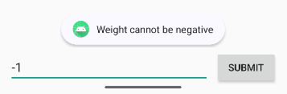
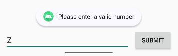
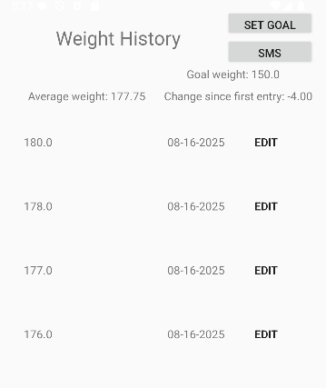
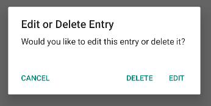
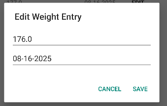

                                                        

# Professional Self-Assessment

Over the past few years in Southern New Hampshire University’s computer science program, I have progressed from writing short single purpose blocks of code to building, testing, and documenting full end to end software. Throughout my time I have been able to diversify my learning and gain knowledge in numerous areas of computer science. This ranged from designing 3D scenes in OpenGL with C++, developing dashboard web applications utilizing Python and MongoDB, creating mobile applications with java, and many more. While each of these projects were different in fundamental aspects, they all allowed me to benefit from learning industry best practices in categories such as design, documentation, and testing across a plethora of real-world use cases. 

These previous experiences have allowed me to gain an understanding of how development might be structured by a future employer. Through my coursework I was able to collaborate in a team environment by discussing different computer science topics along with classmates and implement instructor feedback on ongoing projects. Also, I will be able to communicate my work to stakeholders effectively as I have practiced writing and recording videos describing functionality and design across multiple projects both in technical and non-technical terms. Throughout my projects I implemented my best practice into data structures and algorithms, software engineering and database, and security. Overall, my goal is to deliver solutions that are understandable, testable, and maintainable, while communicating clearly enough that others can build upon it if needed.

This ePortfolio will highlight my progression as I display my strengths in Software Design and Engineering, Algorithms and Data Structure, and Databases. This artifact is a weight tracking android application that I built for the CS360 class in the spring of 2024. I selected this artifact to include in my ePortfolio because it is a good demonstration of my ability to design, develop, and enhance a real-world mobile application. To familiarize yourself with the original version of this application below will be links for my code review, which highlights the functionality and design of the application, as well as a link to the original applications repository. 

### Original Artifacts

[Code Review](https://youtu.be/4D8VbTSMhpw)

[Original Application Repository](https://github.com/dditrichs/CS360_Weight_Tracking_App_Original)

# 1. Software Design and Engineering

This artifact is a weight tracking android application that I built for the CS360 class in the spring of 2024. It allows users to log their daily weight, set a goal weight, and receive SMS notification when their goal weight is received. I chose this artifact for my ePortfolio because it was a good baseline to benefit from some more detailed and tailored software design. In this first enhancement, this artifact was improved to have better input validation in the multiple fields where the users are interacting with the application. Below is a block from the set goal weight string where the input in the string is validated by checking if it is empty, parsing it as a float, and making sure it is greater than 0.

            if (goalStr.isEmpty()) {
                Toast.makeText(DataDisplayActivity.this, "Please enter a valid number", Toast.LENGTH_SHORT).show();
                return;
            }
            float goalValue;
            try {
                goalValue = Float.parseFloat(goalStr);
            } catch (NumberFormatException e) {
                Toast.makeText(DataDisplayActivity.this, "Please enter a valid number", Toast.LENGTH_SHORT).show();
                return;
            }
            if (goalValue < 0) {
                Toast.makeText(DataDisplayActivity.this, "Goal weight cannot be negative", Toast.LENGTH_SHORT).show();
                return;
            }

With this enhancement I met the course outcome that reads, “Design and evaluate computing solutions that solve a given problem using algorithmic principles and computer science practices and standards appropriate to its solution while managing the trade-offs involved in design choices.” I did so by enhancing the app to solve the issue of invalid numbers and letters being able to be submitted to fields where they are not applicable. In addition, the user is presented prompts in these scenarios to let them know where the issue has occurred. This also meets the course outcome that reads, "Develop a security mindset that anticipates adversarial exploits in software architecture and designs to expose potential vulnerabilities, mitigate design flaws, and ensure privacy and enhanced security of data and resources". By ensuring that the validation methods are accurate it defends from invalid input reaching the database and the risk of leaking internal errors to the user. 

Enhancing this application taught me the importance of anticipating user input errors and being able to provide meaningful feedback. I learned to apply defensive programming techniques to handle exceptions gracefully. One challenge that I encountered during my enhancements was ensuring that all possible invalid input scenarios were handled and prompted the user with the appropriate error messages when applicable. Balancing the input validation alongside a smooth user experience required testing of all possible error scenarios to ensure they are handled correctly. 

_example of input validation when trying to log a negative number_

_example of input validation when trying to log a letter_

### Enhancement One Artifacts

[Repository for first enhancement](https://github.com/dditrichs/CS360_Weight_Tracking_App_First_Enhancement)

# 2. Algorithms and Data Structures

This artifact is the same weight tracking android application that I built for the CS360 class in the spring of 2024. I selected this artifact for my ePortfolio because it is a good example of how algorithims can help display useful data to the end user in a real world application. This artifact was improved by adding functionality to show the user their average weight across all logs as well as a total change in weight from the first log to the most recent. This allows for better user experience as it provides further functionality and more data to help the user track their weight better. 

With this enhancement I met the course outcome I set to achieve that reads, “Demonstrate an ability to use well-founded and innovative techniques, skills, and tools in computing practices for the purpose of implementing computer solutions that deliver value and accomplish industry- specific goals”. This was done by adding more functionality that provides value to this application by making it more intuitive and interactive for the end user.

While creating this enhancement I learned the importance of adding data while ensuring it works seamlessly with CRUD operations. I had to use my best skills to ensure that any use case would be met with the correct functionality. One challenge I faced during this enhancement was the average and change weight not updating after a weight log deletion. To fix this I had to ensure that my new updateWeightStats method was being called upon after any deletion.

_Dashboard showcasing average weight and change since first entry functionality_

### Enhancement Two Artifacts

[Repository for second enhancement](https://github.com/dditrichs/CS360_Weight_Tracking_App_Second_Enhancement)

# 3. Databases

This artifact is the same weight tracking android application that I built for the CS360 class in the spring of 2024. I selected this artifact for my ePortfolio because it shows database queries that are called upon through CRUD functionality. This artifact was improved by replacing the single purpose delete icon in the weight log list with an “Edit” button. When clicked, the user is prompted with a dialog that offers the option to either delete the entry or edit it. Choosing “Edit” opens a second dialog pre-filled with the current weight and date values, allowing the user to make changes and save them back to the database. This improvement consolidated two separate actions into a single, more user-friendly workflow while still maintaining the original delete functionality. It also enhanced the CRUD capabilities of the application by supporting update operations alongside the other functioning methods for create, read, and delete.

By carrying out this enhancement I met the course outcome, "Demonstrate an ability to use well-founded and innovative techniques, skills, and tools in computing practices for the purpose of implementing computer solutions that deliver value and accomplish industry- specific goals". I did this by creating new functionality within the app to work in line with various classes to provide a seamless method to edit weight logs. 

During the enhancement I learned the importance of ensuring that during the addition of new features they must be integrated and tested properly to ensure they work with the existing code. One challenge I faced during this was making sure the existing statistics updated correctly after both edits and deletions. I made sure this was working by ensuring that the updateWeightStats method was being called after either action.

_Menu to delete or edit weight log_

_Editing the weight log_

### Enhancement Three Artifacts

[Repository for third enhancement](https://github.com/dditrichs/CS360_Weight_Tracking_App_Third_Enhancement)
